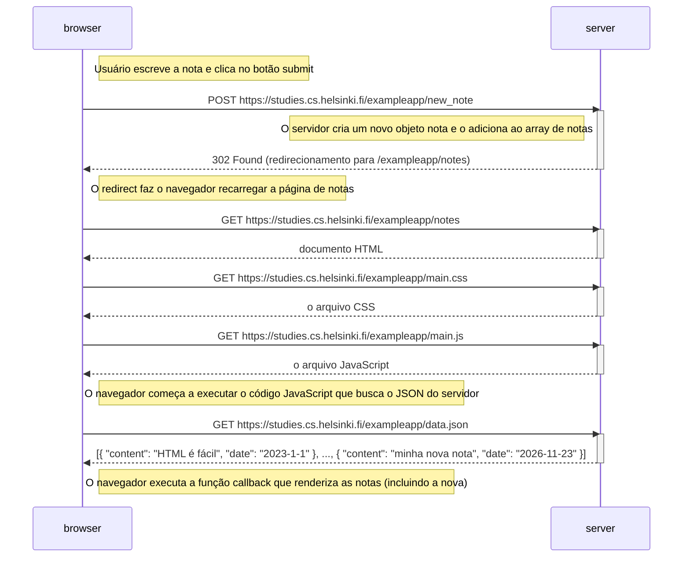

# 0.4: Novo diagrama das notas

Usuário escreve uma nota no campo de texto e clica em "Save" na página https://studies.cs.helsinki.fi/exampleapp/notes

```mermaid
sequenceDiagram
participant browser
participant server

Note right of browser: Usuário escreve a nota e clica no botão submit

browser->>server: POST https://studies.cs.helsinki.fi/exampleapp/new_note
activate server
Note left of server: O servidor cria um novo objeto nota e o adiciona ao array de notas
server-->>browser: 302 Found (redirecionamento para /exampleapp/notes)
deactivate server

Note right of browser: O redirect faz o navegador recarregar a página de notas

browser->>server: GET https://studies.cs.helsinki.fi/exampleapp/notes
activate server
server-->>browser: documento HTML
deactivate server

browser->>server: GET https://studies.cs.helsinki.fi/exampleapp/main.css
activate server
server-->>browser: o arquivo CSS
deactivate server

browser->>server: GET https://studies.cs.helsinki.fi/exampleapp/main.js
activate server
server-->>browser: o arquivo JavaScript
deactivate server

Note right of browser: O navegador começa a executar o código JavaScript que busca o JSON do servidor

browser->>server: GET https://studies.cs.helsinki.fi/exampleapp/data.json
activate server
server-->>browser: [{ "content": "HTML é fácil", "date": "2023-1-1" }, ..., { "content": "minha nova nota", "date": "2026-11-23" }]
deactivate server

Note right of browser: O navegador executa a função callback que renderiza as notas (incluindo a nova)
```
