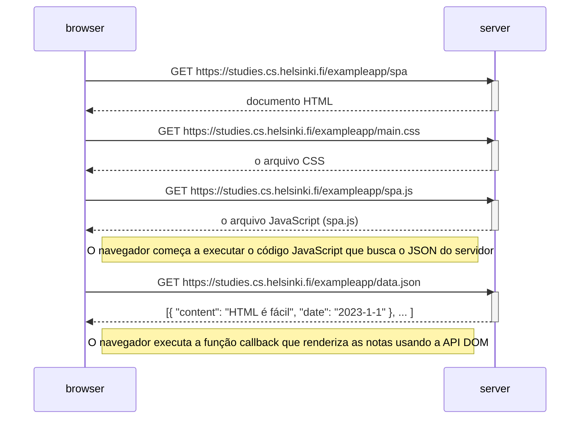

# 0.5: Diagrama de SPA

Usuário abre a versão SPA da aplicação em https://studies.cs.helsinki.fi/exampleapp/spa

```mermaid
sequenceDiagram
participant browser
participant server

browser->>server: GET https://studies.cs.helsinki.fi/exampleapp/spa
activate server
server-->>browser: documento HTML
deactivate server

browser->>server: GET https://studies.cs.helsinki.fi/exampleapp/main.css
activate server
server-->>browser: o arquivo CSS
deactivate server

browser->>server: GET https://studies.cs.helsinki.fi/exampleapp/spa.js
activate server
server-->>browser: o arquivo JavaScript (spa.js)
deactivate server

Note right of browser: O navegador começa a executar o código JavaScript que busca o JSON do servidor

browser->>server: GET https://studies.cs.helsinki.fi/exampleapp/data.json
activate server
server-->>browser: [{ "content": "HTML é fácil", "date": "2023-1-1" }, ... ]
deactivate server

Note right of browser: O navegador executa a função callback que renderiza as notas usando a API DOM
```
