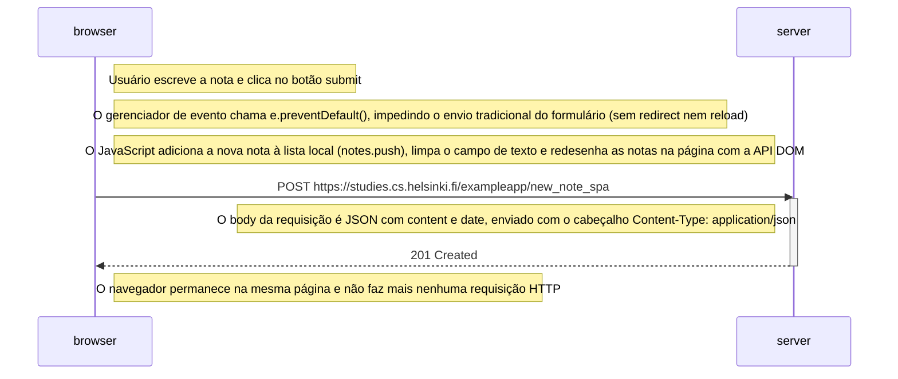

# 0.6: Nova nota no diagrama de SPA

Usuário cria uma nova nota na versão SPA em https://studies.cs.helsinki.fi/exampleapp/spa

```mermaid
sequenceDiagram
participant browser
participant server

Note right of browser: Usuário escreve a nota e clica no botão submit

Note right of browser: O gerenciador de evento chama e.preventDefault(), impedindo o envio tradicional do formulário (sem redirect nem reload)

Note right of browser: O JavaScript adiciona a nova nota à lista local (notes.push), limpa o campo de texto e redesenha as notas na página com a API DOM

browser->>server: POST https://studies.cs.helsinki.fi/exampleapp/new_note_spa
activate server
Note left of server: O body da requisição é JSON com content e date, enviado com o cabeçalho Content-Type: application/json
server-->>browser: 201 Created
deactivate server

Note right of browser: O navegador permanece na mesma página e não faz mais nenhuma requisição HTTP
```
